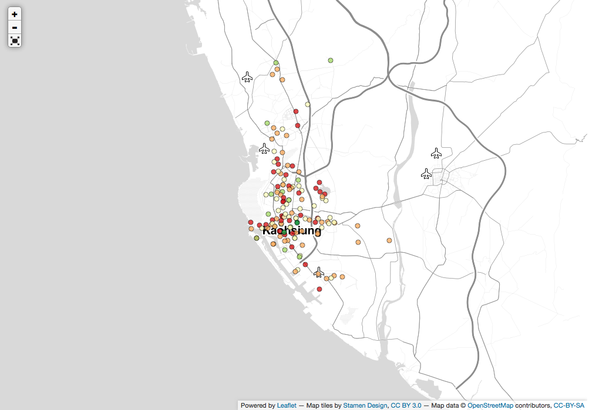

Kaohsiung City Bike
=========================================
Inspired by [Ramnath Vaidyanathan](https://github.com/ramnathv)'s project [Bikeshare](https://github.com/ramnathv/bikeshare)

Data is from [Kaohsiung City Open Data project] (http://data.kaohsiung.gov.tw/Opendata/DetailList.aspx?CaseNo1=AH&CaseNo2=6&Lang=C)

License
-----------------------------------------

This project is licensed under the MIT License. However, the JavaScript charting libraries that are included with this package are licensed under their own terms.

Powered by
-----------------------------------------
1.  [Shiny](http://www.rstudio.com/shiny/)

2. [rCharts](https://github.com/ramnathv/rCharts/)

3. [Leaflet](http://leafletjs.com/)

4. [OpenStreetMap](http://www.openstreetmap.org)
 
